# RPG Character Management System 🛠️

A console-based RPG management system built with Python and MySQL. This project allows users to manage heroes and enemies, perform CRUD operations, and simulate battles using OOP principles.

## Features ⭐

* Hero Management (Create, Read, Update, Delete)
* Enemy Management (Create, Read, Update, Delete)
* Hero Attack System
* Enemy Attack System
* Hero Regeneration
* Damage Upgrade System
* MySQL Database Integration
* Object-Oriented Programming (OOP)

## Technologies Used 💻

* Python
* MySQL
* mysql-connector-python

## Database Schema

### Hero Table

| Column | Type         |
| ------ | ------------ |
| id     | INT          |
| name   | VARCHAR(255) |
| type   | VARCHAR(255) |
| health | INT          |
| damage | INT          |

### Enemy Table

| Column | Type         |
| ------ | ------------ |
| id     | INT          |
| name   | VARCHAR(255) |
| type   | VARCHAR(255) |
| health | INT          |
| damage | INT          |

## Installation ⚙️

```bash
pip install mysql-connector-python
```

Create a MySQL database:

```sql
CREATE DATABASE game_db;
```
Verify Database Connection

```bash
python database.py
```

Run the Application:
```bash
python menu.py
```

## Project Structure

```text
RPG-Character-Management-System
├── screenshots/
│   ├── adddamage.png
│   ├── addhero.png
│   ├── addmenuenemy.png
│   ├── backfrom_menuenemy.png
│   ├── backfrom_menuhero.png
│   ├── changeenemy.png
│   ├── changehero.png
│   ├── connectdb.png
│   ├── deleteenemy.png
│   ├── enemyattack.png
│   ├── exit.png
│   ├── heroattack.png
│   ├── heroregen.png
│   ├── mainmenu.png
│   ├── menuenemy.png
│   ├── menuhero.png
│   └── playmenu.png
├── database.py
├── hero.py
├── enemy.py
└── menu.py
```

## APP Preview 🔍

### Main Menu
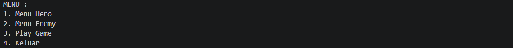

### Hero Management
1. Menu
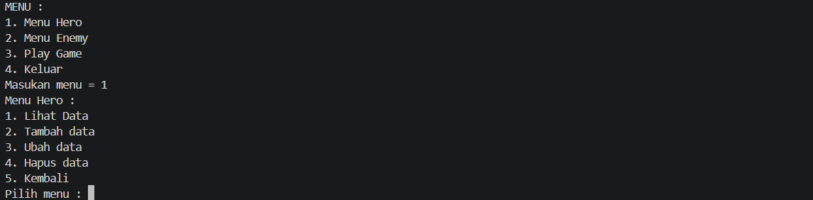
2. List hero
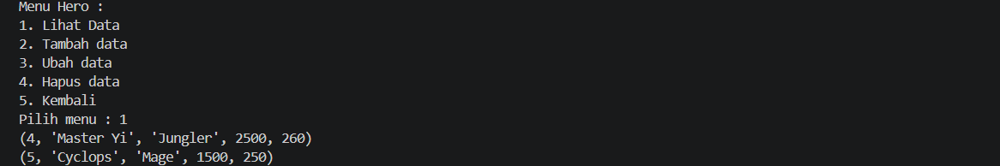
3. Add Hero
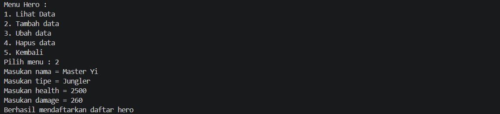
4. Change Hero
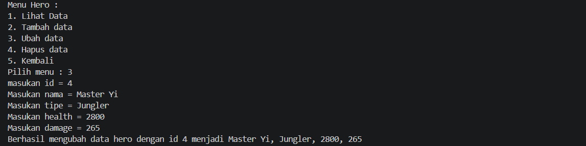
5. Delete Hero
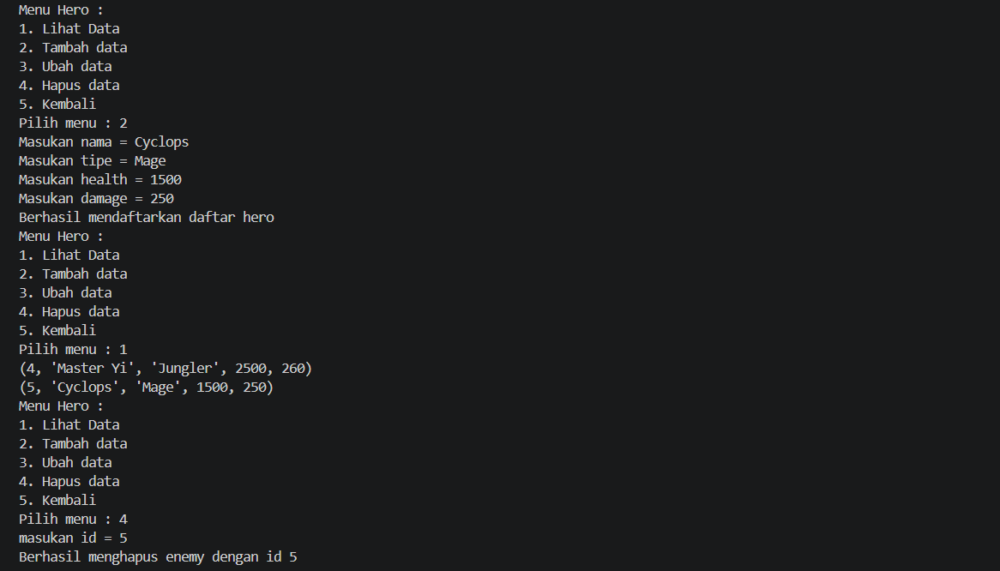
6. Back
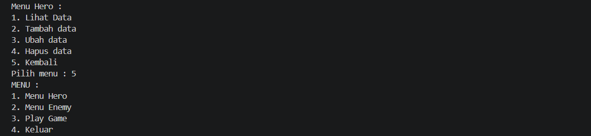

### Enemy Management
1. Menu
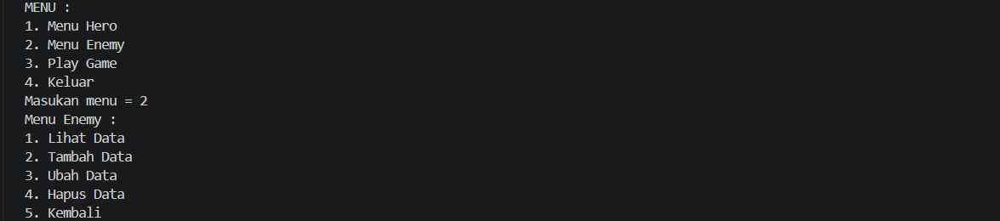
2. Enemy List
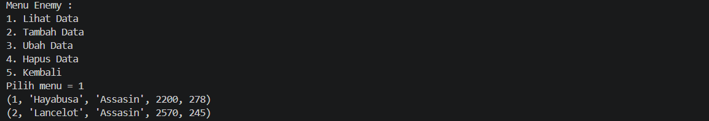
3. Add Enemy
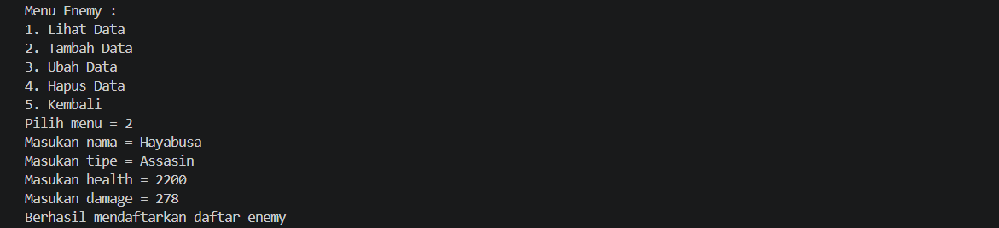
4. Change Enemy
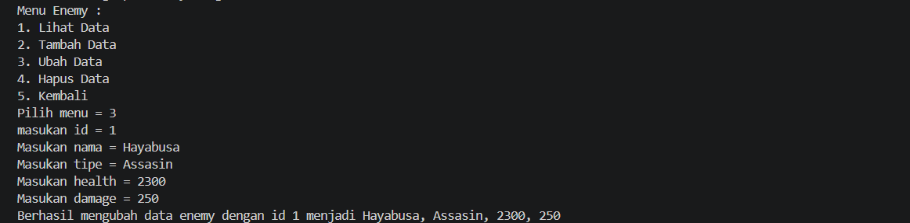
5. Delete Enemy
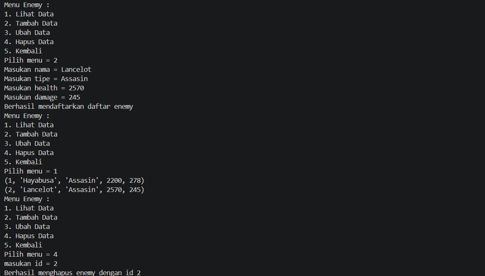
6. Back
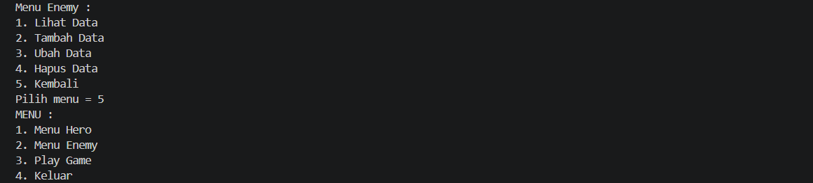

### Battle System
1. Menu
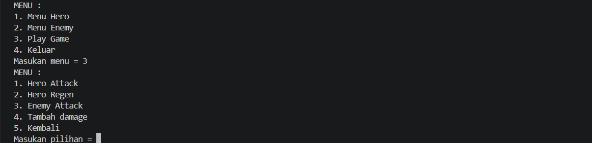
2. Hero Attack
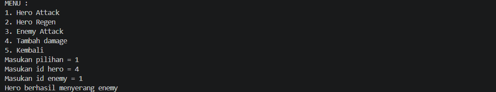
3. Hero Regen
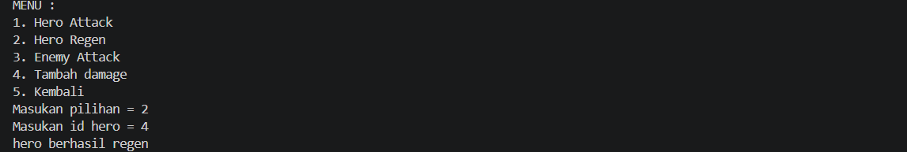
4. Enemy Attack
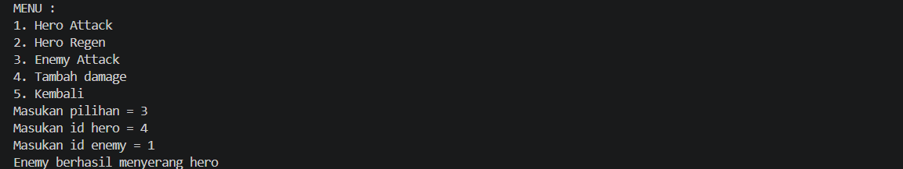
5. Add Damage
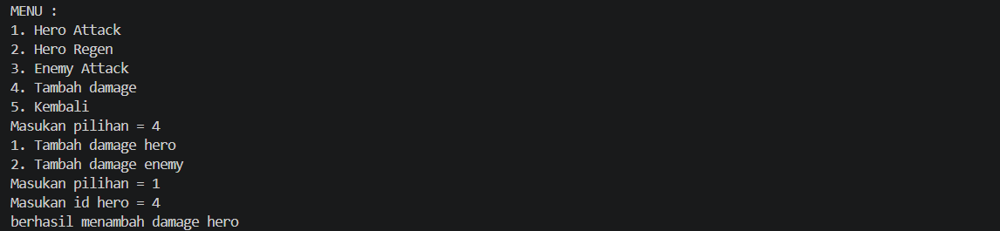
6. Exit
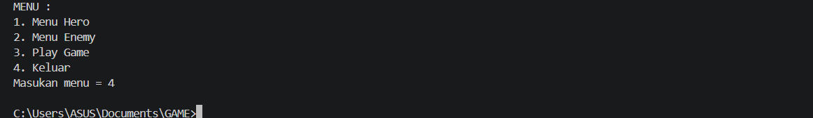


